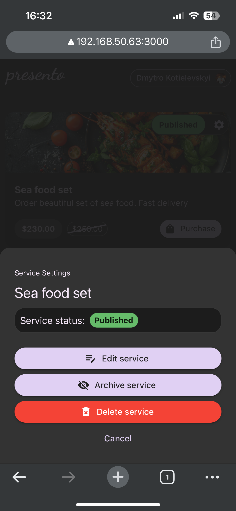

# Demo FullStack Application
* Developer: Dmytro Kotielevskyi 
* Email: deemaaikido@gmail.com 
* GitHub: deema089786

## Start up guide
1. Install NVM and run ```nvm use``` or install Node version based on `.nvmrc` file.
2. Run `npm i`
3. Start database. Exmaple by using Docker:
```bash
docker run --name=demo-A-api-pg --env=POSTGRES_DB=demo-a --env=POSTGRES_USER=root --env=POSTGRES_PASSWORD=root --volume=<path to project directry>/demo-A/docker-volumes/demo-A-api-db:/var/lib/postgresql/data -p 5432:5432 -d postgres:16-alpine
```
4. Add `.env` files into `apps/api` and `apps/app`. See `.env.example` for configuration.
5. Start API: run `nx tbd`
6. Start FrontEnd app: run `nx tbd`

## Project Description
You can see and example of full stack application. 
Application can be used in many ways where people need to show what services they provided,
describe them, and media content, provide prices add receive feedback from the customer.
In the sam time customers can check what services available
and reach the owner for conatact or pucrahces the porduct or service.


## Project Structure
1. Monorepo: All project is build on top of NX monorepo.
2. Language: TypeScript only.
3. BackEnd API: API is build on [NestJS](https://nestjs.com) framework.
4. FrontEnd App: App is build with [Vite](https://vitejs.dev) and [MaterialUI](https://mui.com) as primary UI library.
5. Services and technologies were used:
   6. Database: PostgreSQL + TypeORM.
   7. Validation: [Zod](https://zod.dev).
   8. Storage: [Supabase](https://supabase.com).
   8. UI: [MaterialUI](https://mui.com).
   9. Authentication/Authorization: Google Auth, JWT(login/password).
   10. Client API: [TanStack Query](https://tanstack.com/query/latest).

  
## Key items I want to highlight
* Type safety: In the project same validations (Zod Schemas) used for API payload and FrontEnd form validation.
* StoryBook first: The Majority of components is created in isolation as "dumb" components and tested in Storybook first.
* UI: Atomic design approach used.
* Modules or Feature Slices approach: logic is combined into related sections

## What is not implemented but I would like to add
1. Storybook Component Testing
2. FE runtime configuration

## List of all screenshots
<div style="display: grid; grid-template-columns: repeat(3, 1fr); gap: 20px;">
  
  
  
  
  
  
  
  
  
</div>
