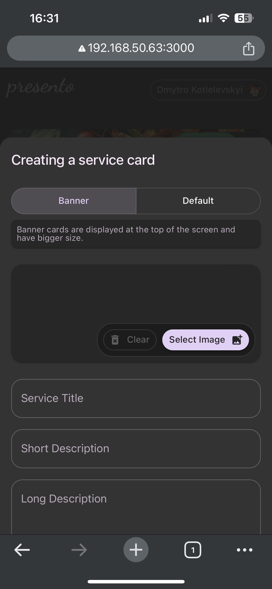

# Demo FullStack Application
* Developer: Dmytro Kotielevskyi 
* Email: deemaaikido@gmail.com 
* GitHub: deema089786

## Start up guide
1. Install NVM and run ```nvm use``` or install Node version based on `.nvmrc` file.
2. Run `npm i`
3. Start database. Exmaple by using Docker:
```bash
docker run --name=demo-A-api-pg --env=POSTGRES_DB=demo-a --env=POSTGRES_USER=root --env=POSTGRES_PASSWORD=root --volume=<path to project directry>/demo-A/docker-volumes/demo-A-api-db:/var/lib/postgresql/data -p 5432:5432 -d postgres:16-alpine
```
4. Add `.env` files into `apps/api` and `apps/app`. See `.env.example` for configuration.
5. Start API: run `nx run app:serve`
6. Start FrontEnd app: run `nx tbd`

## Project Description
You can see an example of a full-stack application that can be used in various ways. It allows people to showcase the services they provide, describe them with media content, set prices, and receive feedback from customers. At the same time, customers can view available services, contact the owner, and make purchases.


## Project Structure
1. **Monorepo**: The entire project is built using the NX monorepo framework.
2. **Language**: TypeScript exclusively.
3. **BackEnd API**: The API is developed with the [NestJS](https://nestjs.com) framework.
4. **FrontEnd App**: The frontend is built with [Vite](https://vitejs.dev) and [Material UI](https://mui.com) as the primary UI library.
5. **Services and Technologies Used**:
   6. **Database**: PostgreSQL with TypeORM.
   7. **Validation**: [Zod](https://zod.dev).
   8. **Storage**: [Supabase](https://supabase.com).
   9. **UI**: [Material UI](https://mui.com).
   10. **Authentication/Authorization**: Google Auth, JWT (login/password).
   11. **Client API**: [TanStack Query](https://tanstack.com/query/latest).


## Key Items to Highlight
* **Type Safety**: The project uses the same Zod schemas for both API payload validation and frontend form validation, ensuring consistency.
* **Storybook First**: Most components are created in isolation as "dumb" components and tested in Storybook first.
* **UI**: The project follows an atomic design approach for building the user interface.
* **Modules or Feature Slices**: Logic is organized into related sections using the feature slices approach.

## Features I'd Like to Add
* Storybook component testing
* Frontend runtime configuration

## List of all screenshots

<p class="mdx-images-grid" style="display: grid; grid-template-columns: repeat(3, 1fr); gap: 20px;">

  

  

  

  

  

  

  

  

  

</p>

[//]: # (|                                                                         |                                                                       |                                                                      |)

[//]: # (|:-----------------------------------------------------------------------:|:---------------------------------------------------------------------:|:--------------------------------------------------------------------:|)

[//]: # (|      |  |  |)

[//]: # (|     |   |  |)

[//]: # (|     |   |  |)
